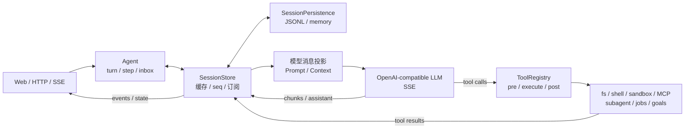
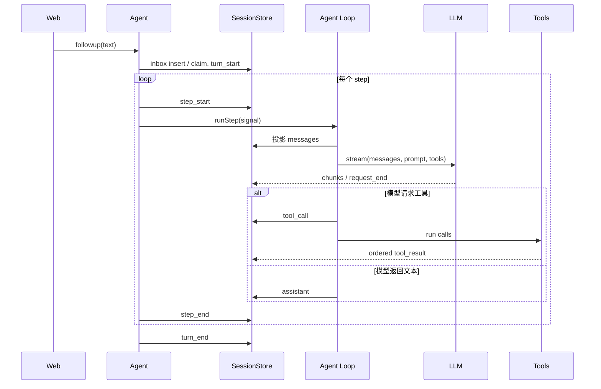
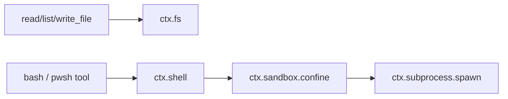
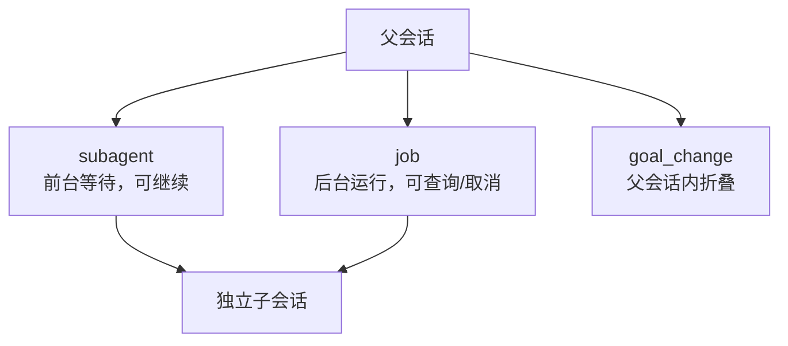

# LOB Harness 技术架构

本文描述当前代码，而不是未来设计。核心不变量只有两个：模型可见内容必须能从持久事件重建；Agent Loop 只负责编排，不按模型、工具或 Provider 类型分支。

## 总体结构



`src/composition.ts` 把 session、LLM、工具、文件系统、子进程、shell、沙箱、prompt、Agent、子 Agent、job 和 goal 组装进 Cordis `Context`。`src/plugins.ts` 再把工具能力变成可启停、可卸载的贡献。

## 会话是事实来源

每个会话是一条仅追加事件流。`SessionPersistence` 只负责 durable load/append/list/fork；`SessionStore` 负责缓存、串行追加、稳定递增 `seq`、订阅和投影失效。

事件大致分为：

| 类别 | 代表事件 | 是否进入模型消息 |
|---|---|---|
| 对话 | `user`、`assistant`、`tool_call`、`tool_result` | 是 |
| 流式 | 文本、推理、工具参数 chunk | 仅由最终提交进入 |
| 生命周期 | `turn_start/end`、`step_start/end`、`request_start/end` | 否 |
| Inbox | 插入、领取 | 领取后的用户内容进入 |
| 控制与审计 | approval、workspace、subagent、job | 否 |
| 上下文 | `context_compacted` | 作为替代 surface 参与投影 |
| 目标 | `goal_change` | 否 |

恢复时校验序号重复、缺口和中间损坏；文件末尾未完成的一行可截断到最后一个完整事件。fork 复制指定 `seq` 边界前的历史，之后父子独立追加。

`projectMessages(events)` 每次从事件重新生成标准模型消息。聊天 transcript、统计、工作区和当前 goal 也都是 projection，不另存第二份权威状态。

## Agent 生命周期



- `followup()` 持久写入 `next_turn` 并唤醒 idle Agent。
- `inject()` 写入 `next_step`，等待活动 turn 的下个 step 边界，不单独唤醒。
- `preStep` 在领取 inbox 后决定允许、改写或拒绝；拒绝首个提案时 turn 仍完整闭合。
- 一个 turn 使用稳定 `AbortSignal`，贯穿 pre-step、模型请求、退避和工具执行。
- 取消时先闭合活动 step，再用 `aborted` 闭合 turn，最后回到 idle。

模型调用以 request attempt 为边界。默认恢复策略只重试空响应、限流和超时，首次请求后最多再试 5 次，500ms 起步、10s 封顶并带 10% jitter。失败 attempt 的 chunk 不会污染后来成功的 assistant。

## 上下文与流式模型

系统提示词和工具 schema 在每次请求前动态读取。Token meter 是可替换 seam；默认按固定字符密度估算，并以模型窗口的 80% 作为压力线。

超预算时先裁剪长工具结果，再把较早历史压缩为摘要，保留最近消息和完整工具调用边界。压缩追加 `context_compacted`，不删除原事件；如果压缩没有足够进展，则返回 `CONTEXT_WINDOW_EXCEEDED`。

LLM 适配器消费 OpenAI-compatible SSE，分别记录文本、推理、工具参数、usage 和 finish reason。只有完整流结束后才提交最终 assistant 或执行组装好的工具调用。

## 工具流水线与调度

工具由 `ToolRegistry` 注册，定义包含模型 schema、executor、execution mode 和可选 timeout。一次调用经过：

```text
preExecute → execute wrappers → executor → postExecute
```

`preExecute` 可允许、拒绝或询问用户。审批只产生一次性授权，`approval_asked` 与 `approval_decided` 会写入会话。未知工具、策略拒绝、executor 异常和 post block 都被规范化为模型可见的错误 `tool_result`。

连续 `parallel` 调用最多并发 4 个；`exclusive` 调用前后都等待，形成 barrier。executor 可以乱序结束，持久结果按模型调用顺序提交。超时会中止该工具，并等待 executor 停稳后返回。

## 执行世界与工作区

文件、进程、shell 和沙箱是独立 service seam：



文件策略同时检查词法路径和 canonical realpath。读取要求普通文件与严格 UTF-8；新文件校验最近存在祖先；写入使用同目录临时文件加 rename。shell 的 `workdir` 必须位于会话工作区。

macOS/Linux 组装 Bash Provider，Windows 组装 PowerShell Provider；PowerShell 使用 `-NoLogo -NoProfile -NonInteractive -Command` 并固定 UTF-8 输出。默认 `SandboxBashProvider` 在 macOS 用 Seatbelt 包装 `bash -c` 后再 spawn。Windows 当前没有 Win32 backend，因此 `read-only`、`workspace-write` 返回 `SANDBOX_UNAVAILABLE`，仅 `danger-full-access` 可明确绕过。沙箱约束的是进程实际副作用，工具前置策略约束的是调用意图，两者不能互相替代。

## 插件、MCP 与委派

基础配置树包含 `base` 与 `web-server`。profile 按 entry id 替换完整 config；`--dump-config` 与实际启动使用同一配置。工具插件卸载时 disposer 会移除 schema 和 executor。

MCP 工具以 `mcp__<server>__<tool>` 注册到同一工具表，仍走统一策略和日志。当前 demo 是进程内 `MemoryMcpSession`；连接失败可选择不注册，且不影响本地工具。

子 Agent、job 和 goal 的归属关系：



`subagent` 省略 `childId` 时创建子会话，传回原 id 时继续。`job` 立即返回 `jobId`，状态和最终输出通过 service 查询。两者的子级工具表都排除嵌套 subagent、写文件、job 和 goal。goal 每次变更追加完整快照，当前值由最后一次 `goal_change` 得出。

## Web 与本地数据

`src/web.ts` 只承担 HTTP/SSE、静态资源和桌面目录选择适配。业务状态通过 Context service 获取。

- `tmp/*.jsonl`：临时会话
- `test/fixtures/`：只读 fixture
- `tmp/config/llm-settings.json`：非敏感模型设置
- `tmp/config/credentials.json`：API Key
- `tmp/config/plugins.json`：插件选择与配置

Web 支持会话创建/删除/清空/fork、工作区切换、停止生成、模型设置、插件启停与 reload。SSE 同时推送持久事件和 Agent 实时状态。

## 当前能力边界

- 只支持 Web 产品，不提供 CLI/TUI。
- MCP 不是完整传输实现；沙箱只有 macOS Seatbelt，Windows PowerShell 的受限模式等待独立 Win32 插件。
- 前台 shell 输出有界，不提供通用进程句柄、spill 或进程树管理。
- job 只运行子 Agent；没有完成 wakeup。
- goal 不驱动 Agent 自动续跑。
- 子 Agent 同进程运行；没有外部 Agent 协议。
